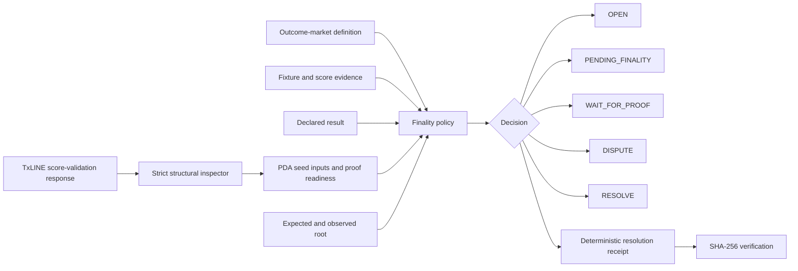

# FinalityGate World Cup Resolver — Submission Packet

> Replace every `PENDING_*` value only from the exact final local release report and public deployment. Do not claim complete TxODDS proof verification until official end-to-end material is reproduced.

## Track

**Markets**

## One-line pitch

A proof-aware World Cup outcome-market resolver that settles only when finality, result evidence, proof material, and the expected on-chain root agree.

## Problem

An outcome market should not resolve merely because a score appears final. Fixture identity, finality, score-derived result, declared result, proof evidence, and expected on-chain root must agree. Missing evidence should delay resolution; conflicting evidence should open a dispute.

## Solution

FinalityGate implements an explicit fail-closed finality state machine:

- `OPEN` — market is active and not eligible for resolution;
- `PENDING_FINALITY` — a possible result exists but the fixture is not final enough;
- `WAIT_FOR_PROOF` — result evidence exists but required proof/root evidence is incomplete;
- `RESOLVE` — every required check agrees;
- `DISPUTE` — fixture, result, proof, or root evidence conflicts.

Every state transition generates a deterministic resolution receipt binding the market definition, evidence, policy version, checks, reasons, and result.

## What makes this build strong (verifiable settlement layer)

- **Real 32-byte Merkle settlement commitment.** Each resolution is committed to a genuine SHA-256 Merkle root (domain-separated leaves/nodes) over its facts, with a per-fact **inclusion proof**. `POST /api/commitment` returns the root + proofs and self-verifies that the declared result is provably included. This is exactly the 32-byte value a Solana `validateStat`-style settlement program would store and compare — computed and verified here, no chain call executed.
- **Hash-linked settlement ledger + batch root.** `GET /api/ledger` builds an append-only, hash-linked ledger over the demo resolutions and commits the whole batch to a single **batch Merkle root** (a rollup-style anchor), with a machine-checkable `verification: PASS`. `POST /api/resolve/batch` does the same for a submitted batch of markets.
- **Fail-closed, non-bypassable.** A market reaches `RESOLVE` only when fixture identity, finality, score, declared result, proof, and root all agree; otherwise `WAIT_FOR_PROOF`, `PENDING_FINALITY`, or `DISPUTE` — each with an explicit reason and its own receipt.
- **Auditor-facing provenance.** `POST /api/explain` turns any resolution into a plain-language explanation: which evidence checks passed/failed, the dispute taxonomy, and concrete remediation / next actions.
- **Honest on-chain framing.** `GET /api/onchain-anchor` maps the batch root to the PDA-seed shape a Solana settlement program would anchor (`daily_scores_roots` seed), with an explicit `onchain_call_executed: false` and a clear note that no real program-derived address is claimed — the honest proof boundary is preserved.
- **Quantified impact vs a naive resolver (the headline number).** The dashboard leads with a hard counterfactual: against a naive resolver that settles on the declared result the moment a fixture is final, FinalityGate reports the **unsafe settlements it prevented** — final markets a naive bot would have settled on missing proof, a mismatched on-chain root, or a score that contradicts the declared result. `GET /api/impact`; computed from the real decisions, no monetary value claimed.
- **Verify a proof in your own browser (interactive explorer).** `/explorer` lets a judge click any resolution fact and watch its inclusion proof fold cryptographically up to the 32-byte root — **re-verified live client-side** with real SHA-256 (Web Crypto), no server trust — exactly what a settlement contract checks on-chain. A **"flip a byte" tamper control** corrupts one fact and shows the proof failing to fold to the root — proving the commitment is tamper-evident, not decorative.
- **Change the evidence yourself (interactive resolver playground).** `/resolver` lets a judge flip finality, score, declared result, proof status, and on-chain root and watch the fail-closed state machine move between `OPEN` / `PENDING_FINALITY` / `WAIT_FOR_PROOF` / `DISPUTE` / `RESOLVE` live, each with reasons + a SHA-256 receipt. Backed by the real `POST /api/resolve` (same engine as the API and CLI), not a mock.
- **Run it offline, no credentials.** `finalitygate commitment` resolves a market/evidence pair and builds its Merkle commitment with an inclusion-proof self-check; `finalitygate explain` returns the checks/dispute-taxonomy/remediation; `finalitygate ledger` builds and verifies the batch-committed settlement ledger. Seeded property-style robustness tests assert the fail-closed invariant (a declared result that conflicts with the score never settles) over thousands of adversarial inputs.

## What judges can verify

- standalone no-wallet demo;
- all five finality states;
- score/result conflict detection;
- invalid-proof handling;
- missing-proof fail-closed behavior;
- required concrete proof reference;
- required expected and observed root values;
- root mismatch detection;
- deterministic receipt generation and tamper detection;
- a real 32-byte Merkle settlement commitment with per-fact inclusion proofs (`/api/commitment`);
- a hash-linked settlement ledger with a batch Merkle root, re-verifiable live (`/api/ledger`);
- strict inspection of the documented TxODDS `/api/scores/stat-validation` response shape;
- exact 32-byte proof-node normalization from hex, base64, or byte arrays;
- documented `daily_scores_roots` PDA seed-input derivation;
- explicit evidence that structural inspection did **not** execute the Solana `validateStat` view;
- local release report, exact test count, SBOM, security scan, isolated wheel execution, and deterministic judge-pack hash.

## Demo climax

Three final-looking markets receive different outcomes:

1. a final score without sufficient proof produces `WAIT_FOR_PROOF`;
2. conflicting result or root evidence produces `DISPUTE`;
3. complete consistent evidence produces `RESOLVE`.

The judge opens and verifies the exact resolution receipt for every case. A separate proof-readiness panel or CLI output shows the normalized official validation structure, deterministic fingerprint, PDA seed inputs, and the explicit `onchain_view_executed: false` boundary.

## Architecture



## Reproducibility

Final release evidence:

```text
Tests:         132 passing (pytest, product suite; incl. seeded robustness + CLI)
Public source: github.com/teodorstupariu-dot/Concurs  (private dev monorepo)
Public demo:   https://txodds-portfolio-host.onrender.com/finalitygate/
```

The authoritative values come from:

```text
outputs/local_validation_report.json
RELEASE_REPORT.json
outputs/release_assets.json
```

**Final human gate (only the participant can set these):** the deployed build's
exact commit SHA (confirm in Render → Events after the next deploy), the recorded
video URL, and any judge-pack hash if a fresh pack is regenerated.

## Judge quick-verify links (public, read-only)

- Dashboard: https://txodds-portfolio-host.onrender.com/finalitygate/
- **Resolver playground (flip the evidence, watch fail-closed states):** https://txodds-portfolio-host.onrender.com/finalitygate/resolver
- **Merkle proof explorer (verify in-browser + tamper demo):** https://txodds-portfolio-host.onrender.com/finalitygate/explorer?auto=1
- Health: https://txodds-portfolio-host.onrender.com/finalitygate/api/health
- All five states (demo): https://txodds-portfolio-host.onrender.com/finalitygate/api/demo
- **Settlement ledger + batch root:** https://txodds-portfolio-host.onrender.com/finalitygate/api/ledger
- Merkle commitment (POST): `POST /finalitygate/api/commitment` with a market+evidence body
- API docs: https://txodds-portfolio-host.onrender.com/finalitygate/api/docs

## TxODDS validation integration

FinalityGate supports credential-safe retrieval of the documented score-stat validation endpoint:

```bash
finalitygate live-score-validation \
  --fixture-id FIXTURE_ID \
  --seq SEQUENCE \
  --stat-key STAT_KEY \
  --out outputs/live_score_validation.json
```

The command does not persist the raw licensed response or credentials. It stores only the normalized structural inspection, fingerprint, safe request identifiers, and explicit claim boundary.

## Proof boundary

The current resolver enforces proof and root evidence contracts and strictly inspects the documented validation payload. It does not yet execute the Solana program's read-only `validateStat(...).view()` method.

A complete TxODDS proof-validation claim requires all of the following from official material:

1. matching network, program ID, and IDL;
2. official validation material for a known record;
3. derivation and retrieval of the corresponding daily-scores PDA;
4. execution of the documented on-chain validation view;
5. a known-valid result;
6. altered proof/root cases that fail;
7. local reproduction and evidence capture.

Until those conditions are reproduced, FinalityGate must use `WAIT_FOR_PROOF`, `DISPUTE`, or an explicit limitation rather than inventing proof validity.

## Independence

FinalityGate has its own source tree, package metadata, tests, CLI, local gate, release report, TxLINE validation client, validation inspector, demo, Docker image, deployment configuration, submission packet, SBOM, and judge pack. It does not depend on ProofGuard runtime or output artifacts.

## Safety and claim boundary

FinalityGate is a market-resolution prototype. It does not:

- custody funds;
- release real escrow;
- execute wagers;
- settle real-money positions;
- sign user transactions;
- provide financial advice.

## Closing statement

**FinalityGate resolves only when the complete evidence agrees; otherwise it waits or opens a dispute with an exact, verifiable receipt.**
