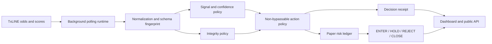

# ProofGuard Autonomous Agent — Submission Packet

> Replace every `PENDING_*` value only from the exact final local release report and deployed application. Do not submit historical hashes or unverified claims.

## Track

**Trading Tools and Agents**

## One-line pitch

A live TxODDS autonomous paper-trading agent whose signal engine can never bypass a deterministic market-integrity policy.

## Problem

A sports-market signal can look attractive while its source data is stale, incoherent, incomplete, backwards in time, or not proof-ready. An agent optimized only for activity can take an unsafe action and leave no defensible record of why it acted.

## Solution

ProofGuard is a running FastAPI application with an autonomous background loop. It ingests TxLINE odds and optional scores, normalizes them, evaluates a deterministic strategy, applies a non-bypassable integrity policy, updates a simulated paper ledger, and publishes a SHA-256 receipt for every action or refusal.

The agent emits:

- `ENTER`
- `HOLD`
- `REJECT`
- `CLOSE`

Integrity `REVIEW` or `BLOCK` can never produce `ENTER`.

## What makes this build strong (verifiable upgrades)

- **Provable, tamper-evident history.** Every decision receipt is hash-linked to the previous one (append-only chain anchored at a fixed genesis). `GET /api/receipts/verify` re-proves, without trusting any field, that no live decision was edited, inserted, removed, or reordered — a judge can run it and read `status: PASS`.
- **Real market math (de-vig).** Raw implied probabilities carry the bookmaker margin (overround). ProofGuard normalizes the book to a vig-free *fair probability* and measures edge against that; each receipt exposes `fair_probability`, `raw_market_probability`, and `overround`.
- **Explainable in-play model.** The signal is a deterministic in-play Poisson model (pre-match prior + current score + match minute), not static constants. `GET /api/model/preview` shows the probability distribution reacting to goals and converging at full time. No ML, fully reproducible.
- **Autonomous match narrative.** In the public REPLAY demo the agent plays a scripted 1'→90' match — value entry, drift, a second entry, a stale-feed REVIEW, a corrupted-feed BLOCK/REJECT, recovery, a late entry, a proof-wait, and a full-time CLOSE — exercising every action and every integrity verdict in order.
- **Autonomous risk controls.** Position sizing is **fractional Kelly** on the fair edge (hard-capped by per-position and portfolio exposure limits). The agent auto-engages **reduced-risk** mode on a streak of integrity flags and auto-trips a **kill switch** on an integrity *storm* (consecutive BLOCK cycles); the kill switch is sticky and requires an explicit operator reset. All of this is reported in the snapshot (`portfolio.auto_controls`) and in each cycle's `auto_control_actions`.
- **Quantified impact vs a naive agent (the headline number).** The dashboard leads with a hard, honest counterfactual: measured against a *naive edge-only agent* that enters any signal clearing the same edge/confidence thresholds but ignores the integrity gate, ProofGuard reports the **integrity exploits it blocked** (signals a naive agent would have taken but that failed the gate), the **largest fake edge refused**, and the **paper exposure kept off the book**. Computed from the real receipts (`integrity_impact` in the snapshot); no monetary P&L is asserted.
- **Attack it yourself (interactive playground).** `/playground` feeds the agent a preset attack — corrupted book, backwards timestamp, no proof — and shows the fail-closed gate reject it live even with a ~36% edge. Backed by the stateless `GET /api/simulate?scenario=` endpoint (a fresh agent per call).
- **Honest decision analytics.** The dashboard's *Decision distribution* tile counts every decision this session by integrity-gate verdict (PASS/REVIEW/BLOCK) and by action (ENTER/HOLD/REJECT/CLOSE) — computed from the receipts themselves — with a safety badge proving **`0 unsafe ENTERs`** (the agent never ENTERs on a non-PASS gate). Exposed as `decision_distribution` in the snapshot.
- **Run it offline, no credentials.** `proofguard simulate` runs the gate scenarios locally; `proofguard simulate --chain` emits a genuine append-only receipt chain and `proofguard verify-chain` independently re-proves it (`status: PASS`). Seeded property-style robustness tests assert the safety invariant and chain integrity over thousands of adversarial inputs.

## Live application behaviour

The deployed service starts its own polling loop and does not require human approval between cycles. The public dashboard and API expose:

```text
GET /
GET /api/health
GET /api/snapshot
GET /api/status
GET /api/market/latest
GET /api/decision/latest
GET /api/positions
GET /api/receipts
GET /api/receipts/verify     # re-proves the live receipt chain (integrity + linkage + order)
GET /api/model/preview       # in-play model probabilities across a scripted match
GET /api/simulate?scenario=  # runs a preset market scenario (incl. attack) through a fresh agent
GET /playground              # interactive integrity-gate playground (attack the gate)
GET /api/docs
```

The source is always labelled honestly:

- `LIVE` — the cycle used TxLINE;
- `REPLAY` — deterministic bundled replay;
- `REPLAY_FALLBACK` — live retrieval failed and labelled replay kept the product inspectable;
- `ERROR` — no usable cycle is available.

Replay is never presented as live activity.

## What judges can verify

- a working public web application and API;
- autonomous background polling without per-cycle input;
- normalized TxLINE odds and optional score ingestion;
- paper-position open, resize, maintain, safety close, and fixture-final close;
- aggregate and per-position exposure caps;
- minimum edge and confidence floor;
- reduced-risk mode and emergency kill switch;
- non-bypassable `PASS / REVIEW / BLOCK` integrity;
- `ENTER / HOLD / REJECT / CLOSE` decisions;
- deterministic receipts binding source evidence, controls, integrity, signal, action, and paper exposure;
- a hash-linked receipt chain that a judge can re-verify live (`/api/receipts/verify`);
- de-vig fair-probability edge with explicit overround on every receipt;
- a deterministic in-play Poisson model reacting to score and time (`/api/model/preview`);
- bounded public receipt history;
- credential redaction and no raw TxLINE-payload persistence;
- explicit live/replay/fallback labelling;
- strict inspection of the documented `/api/odds/validation` response;
- test count, web smoke evidence, isolated wheel execution, security scan, SPDX SBOM, and judge-pack hash.

## Demo climax

The demo begins with the deployed dashboard in `LIVE` mode. A positive model edge appears, but unsafe market evidence causes `REVIEW` or `BLOCK`. ProofGuard refuses the entry because the integrity policy is authoritative. The receipt is opened and verified.

The video also shows:

1. the background loop updating without manual approval;
2. an accepted paper entry under clean evidence;
3. paper exposure and positions;
4. an integrity-driven refusal;
5. a receipt hash;
6. the explicit simulation-only boundary;
7. the labelled replay fallback for post-match review.

## Architecture



## TxLINE endpoints used

The implementation supports:

```text
GET /api/odds/snapshot/{fixtureId}
GET /api/scores/snapshot/{fixtureId}
GET /api/odds/validation?messageId=...&ts=...
```

The live web runtime uses odds snapshots and, when enabled, score snapshots. Odds-validation retrieval is used for proof-readiness inspection. Credentials remain exclusively in server-side environment variables.

Raw licensed responses are processed in memory and are not persisted by the live runtime.

## Reproducibility

Final release evidence:

```text
Tests:              89 passing (pytest, product suite; incl. seeded robustness + CLI)
Public source:      github.com/teodorstupariu-dot/Concurs  (private dev monorepo)
Public application: https://txodds-portfolio-host.onrender.com/proofguard/
```

Authoritative evidence:

```text
outputs/local_validation_report.json
RELEASE_REPORT.json
outputs/release_assets.json
```

**Final human gate (only the participant can set these):** the deployed build's
exact commit SHA (confirm in Render → Events after the next deploy), the recorded
video URL, and any judge-pack hash if a fresh pack is regenerated. Everything
above is verifiable now from the live demo and the test suite.

## Judge quick-verify links (public, REPLAY, read-only)

- Dashboard: https://txodds-portfolio-host.onrender.com/proofguard/
- **Playground (attack the gate):** https://txodds-portfolio-host.onrender.com/proofguard/playground?scenario=corrupt_block
- Health: https://txodds-portfolio-host.onrender.com/proofguard/api/health
- Live snapshot: https://txodds-portfolio-host.onrender.com/proofguard/api/snapshot
- **Verify receipt chain:** https://txodds-portfolio-host.onrender.com/proofguard/api/receipts/verify
- **In-play model:** https://txodds-portfolio-host.onrender.com/proofguard/api/model/preview
- API docs: https://txodds-portfolio-host.onrender.com/proofguard/api/docs

## Production-readiness measures

- one-process FastAPI service and autonomous runtime;
- container deployment;
- `/api/health` health check;
- bounded receipt and error history;
- retry/backoff and bounded provider responses;
- provider-error redaction;
- no raw credential fields in public state;
- no raw TxLINE-payload persistence;
- deterministic replay fallback;
- exact source-mode labelling;
- non-root Docker user;
- local test/build/release gate;
- isolated wheel web smoke test;
- secret scan, SBOM, and deterministic judge pack.

## TxLINE feedback

To be completed by the participant from the actual authorized live run (what
worked well, friction encountered, suggested improvement). These must reflect
real integration experience, not invented content — the public demo runs in
REPLAY and does not exercise live credentials.

## Proof boundary

ProofGuard inspects the documented validation response and derives documented daily-odds PDA seed inputs. It does not yet serialize the exact odds-record leaf or execute the Solana `validateOdds` call.

A complete proof claim requires exact official serialization, the matching network/program/IDL/account, a known-valid executed validation, and altered proof/root failures. Until then, the feature is described as proof-readiness inspection.

## Safety and legal-product boundary

ProofGuard performs simulated paper execution only. It does not:

- accept deposits or withdrawals;
- connect user wallets;
- place real-money wagers;
- custody funds or crypto-assets;
- sign or execute user transactions;
- settle real positions;
- provide investment advice;
- promise profitability or production predictive accuracy.

## Closing statement

**ProofGuard proves not only why an autonomous agent acted, but why it refused when the evidence was not safe enough.**
